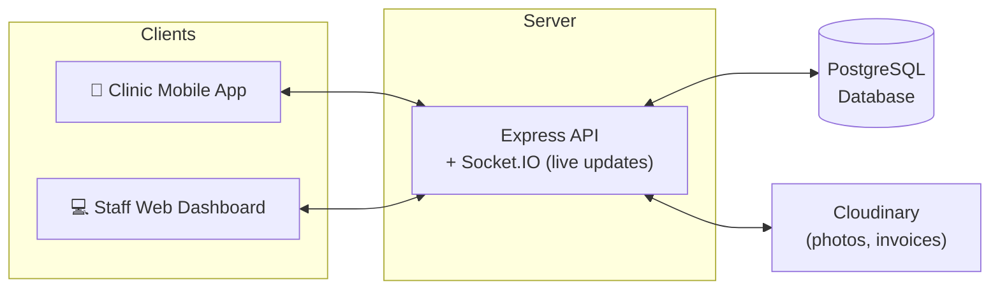
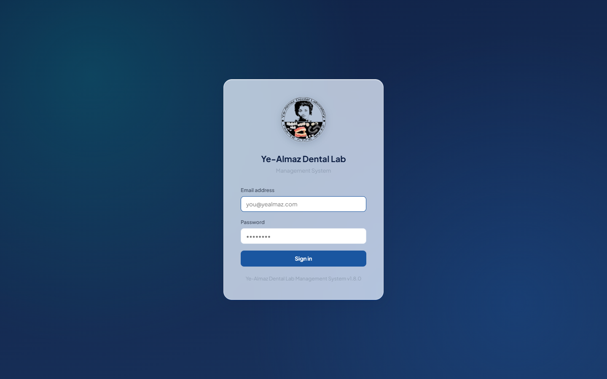
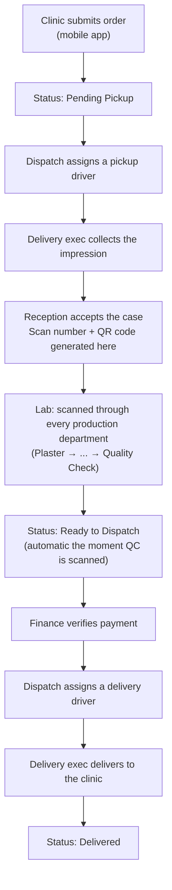

# Ye-Almaz Dental Lab — System Feature Guide

A complete walkthrough of what the Ye-Almaz management system does, department
by department. This is a feature reference, not a technical manual — for API
routes, database schema, and code structure, see [README.md](../README.md).

> **A note on the images in this doc:** the login screen below is a real
> screenshot of the running system. The rest of this document uses diagrams
> rather than screenshots of logged-in dashboards, since those would require
> using real staff accounts and real clinic data to capture.

---

## What the system is

Ye-Almaz runs the full life of a dental lab order — from the moment a clinic
requests a pickup, through every production department, to final delivery
and payment — as one continuously tracked digital record. Three separate
applications share one backend:

| App | Who uses it | How |
|---|---|---|
| **Clinic mobile app** | Dentists/clinics | Submit orders, track status, pay, redeem loyalty points |
| **Staff web dashboard** | Reception, Dispatch, Delivery, Lab, Finance, Admin | Everything on the lab side — the subject of this doc |
| **Backend API** | (invisible) | Node/Express + PostgreSQL, ties both apps together in real time via Socket.IO |

Every staff member logs into the same web address; the system shows only
the pages relevant to their role.

---

## Roles at a glance

| Role | What they're responsible for |
|---|---|
| **Reception** | First point of contact — accepts arrived impressions, creates phone/walk-in orders, keeps the case list |
| **Dispatch** | Coordinates every pickup and delivery driver; the traffic-control center between clinics and the lab |
| **Delivery** | Drivers — see only their own assigned pickups/deliveries for the day |
| **Lab Tech** | Scans each case's QR code as it moves through their department |
| **Finance** | Verifies payments, issues invoices, manages Trusted Partner monthly billing |
| **Admin** | Sees and controls everything — analytics, pricing, staff, clinics, rewards |

---

## The case lifecycle, end to end

A case is one physical order (one impression, one QR code, one delivery) —
this is the spine the whole system is built around.

Two shortcuts skip parts of this path when appropriate:
- **Self drop-off / self pickup** — if the clinic brings the impression in
  person, or collects the finished case themselves, dispatch records that
  directly with no driver involved.
- **Remake / redo** — a free (remake) or half-priced (redo) replacement case
  skips the payment-verification wait and goes straight to dispatch, since
  nothing new is owed for it.

If a clinic cancels a pickup before it's ever collected, or an order needs
to be scrapped entirely before acceptance, Dispatch can mark it cancelled or
delete it outright — keeping the reception queue and database clean of
orders that never actually happened (any loyalty points already awarded for
it are automatically reversed).

---

## Reception

*Pages: Dashboard, Cases, New Case*

- **Accept incoming cases** — impressions that have arrived at the lab wait
  in an "Arrived at Lab" queue; reception reviews and either accepts,
  rejects, or flags them for review before they enter production
- **Create a case directly** — for phone orders or walk-ins, without going
  through the mobile-app/pickup flow: patient info, work type, tooth
  selection (a visual odontogram), shade, delivery type (Normal/Express),
  with price and due date calculated automatically from the work type's
  price list
- **Aligner cases** get a tray-count selector instead of a tooth chart —
  no odontogram or shade needed
- **Digital/3D-file intake** — cases submitted as a scan file rather than a
  physical impression, with a per-arch scan fee added automatically
- **Remake/redo entry** — link a new case back to the original it's
  replacing, with the correct free/half-price billing applied automatically
- **Full case list** (`Cases` page) — search, filter by status/payment/date,
  export to Excel

---

## Dispatch

*Page: Dispatch Dashboard*

The busiest screen in the system — six tabs tracking every case from
"needs a driver" to "delivered":

| Tab | What's in it |
|---|---|
| Place Order | New pickup requests waiting for a driver |
| Pickup In Progress | Driver assigned, impression not yet at the lab |
| Ready for Delivery | Finished cases waiting on payment verification |
| Ready for Dispatch | Finished cases cleared to go (paid, Trusted Partner, or a free remake) |
| En Route | Out for delivery |
| Delivered | Completed |
| All Cases | Full searchable/filterable history across every status |

- **Assign / reassign a driver** for pickup or delivery at any point
- **Self Drop-off** — record that a clinic brought the impression in
  themselves, skipping the driver step
- **Self Pickup** — record that a clinic collected the finished case in
  person, skipping "Out for Delivery" and marking it delivered directly
- **Phone orders** — create a pickup request on a clinic's behalf over the
  phone
- **Cancel Pickup** — the clinic backed out before the impression was
  collected; keeps the order out of Reception's queue without deleting the
  record
- **Delete Order** — remove an order entirely if it never should have
  existed (only available before it's been accepted into production)
- Every tab has its own search, status, clinic, and date filters, plus
  Excel export

---

## Delivery (drivers)

*Page: Delivery Dashboard — one per logged-in driver*

- A personal queue of only **their own** assigned pickups and deliveries
  for the day — nothing else clutters the screen
- **Confirm impression collected** from a clinic → case moves into the lab
  queue
- **Confirm delivered** to a clinic → case marked complete, clinic notified
  instantly
- **Return to queue** — if a pickup or delivery couldn't be completed (gate
  locked, clinic closed, etc.), hand it back to Dispatch for reassignment
  rather than leaving it stuck

Reception/Dispatch staff have their own read-only view of everything
currently ready for delivery (the `Delivery` page), separate from each
driver's personal working queue.

---

## Lab (production floor)

*Page: Lab Dashboard*

- **QR scanner** — point a device camera at a case's QR label to record
  that it has arrived at a department; the case's status advances
  automatically
- **16 department stations**, covering the full production path:

  Reception → Plaster → Margin → Scanning → Designing → (Milling/Sintering
  *or* Resin 3D Printing *or* Metal 3D Printing) → Metal Finishing → Opaque
  Application → Ceramic Layering → Zirconia Fitting → Glazing → Thermo
  Press → Trimming → **Quality Control**

  Scanning **Quality Control** automatically advances the case straight to
  "Ready to Dispatch" — no separate step needed.
- Lab tech accounts can be **restricted to specific departments** (set by
  Admin), so a scanning-department tech only sees scanning-relevant actions
- **Live case timeline** — every scan for a case, with timestamp and who
  scanned it
- **My Performance** — each lab tech can pull up their own activity: total
  scans, unique cases touched, which departments they worked in, and a
  daily activity chart, for any date range

---

## Finance

*Pages: Finance Dashboard, Billing, Payments*

- **Request payment** on a case once it's ready, and track it through the
  cycle: requested → screenshot uploaded → verified (or rejected)
- **Verify uploaded payment screenshots** — approve unlocks the case for
  delivery; reject sends it back to the clinic with a reason
- **Manual payment entry** for cash or bank transfers that didn't go
  through the mobile app
- **Issue invoices** with a printable, formatted layout
- **Trusted Partner billing** — some clinics are billed on a monthly
  statement instead of per case; Finance generates that statement showing
  only cases that have actually been *delivered* in the period, so nothing
  still in production shows up as owed
- A dedicated **Payments** queue auto-refreshes so newly uploaded screenshots
  surface without a manual reload

---

## Admin

*Pages under `/admin` — the control center for the whole lab*

- **Analytics Dashboard** — KPI cards (revenue, outstanding balance,
  cases in progress, turnaround time), a 6-month revenue trend, a
  cases-by-status breakdown, and revenue by work type
- **Case Status Board** — a live, per-department pipeline view; click any
  department to see exactly which cases are sitting there right now
- **Case Management** — every case in the system, with full edit and
  delete capability
- **Clinics** — create/edit clinic accounts, toggle active status, mark a
  clinic as a Trusted Partner (monthly billing instead of per-case), export
  the full clinic list (name, contact info, station, zone, partner status)
  to Excel/PDF
- **Zones** — group delivery/pickup **Stations** (specific pickup areas)
  into named **Zones** so Dispatch can quickly find coverage for a case's
  area
- **Pricing** — the price list every case is costed against: standard
  price, express price, turnaround days, and a flat-rate toggle for items
  priced per case rather than per unit (night guards, retainers, etc.)
- **Users** — create staff accounts for every role, restrict lab techs to
  specific departments, assign station/zone for routing, auto-generated
  passwords with a one-time credentials reveal, deactivate/reset as needed
- **Lab Performance** — roster-wide version of "My Performance": every lab
  tech's scan volume, department mix, and activity trend side by side, for
  spotting workload imbalances
- **Rewards** — the clinic loyalty program: how many points a case earns,
  the redeemable reward catalog, a clinic points leaderboard, and approving
  or rejecting redemption requests

---

## Clinic loyalty / rewards program

Every case a clinic submits earns loyalty points automatically. Clinics can
see their balance and redeem it against a reward catalog Admin manages;
Admin approves or rejects each redemption request. If an order is cancelled
or deleted before it's ever picked up, the points it earned are
automatically clawed back — clinics never end up with points for an order
that never actually happened.

---

## Notifications & real-time updates

The dashboard doesn't need refreshing — every relevant screen updates
itself the moment something changes elsewhere:

- A new case appearing anywhere in the pipeline
- A case's status advancing (scanned at a new department, delivered, etc.)
- A payment being verified or rejected

Clinics get the same real-time treatment on their mobile app, plus push
notifications (e.g. "✅ Case Delivered") even when the app isn't open.

---

## Reports & exports

Most list views across the system (Cases, Clinics, Dispatch tabs, Case
Status Board, Payments, invoices) include an **Export** button producing an
Excel or formatted PDF version of exactly what's currently on screen —
respecting whatever search/filter/date-range is applied at the time.

---

## Clinic mobile app

The counterpart clinics use, out of scope for the staff dashboard above but
part of the same system:

- Submit a new order — tooth selection, work type, shade, delivery speed
- Track every case's live status and full timeline
- Upload a payment screenshot or pay via Chapa (online payment), download
  the invoice
- View and redeem loyalty points
